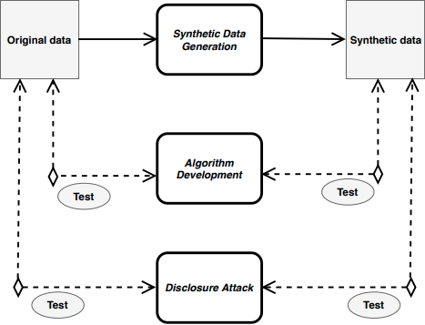

# SynRec
This repository releases the implementation of "SynRec" in our papers: *Partially Synthetic Data for Recommender Systems:
Prediction Performance and Preference Hiding* [paper](http://google.com). and *Comparing recommender systems using synthetic data* [paper](https://dl.acm.org/doi/abs/10.1145/3240323.3240325).

